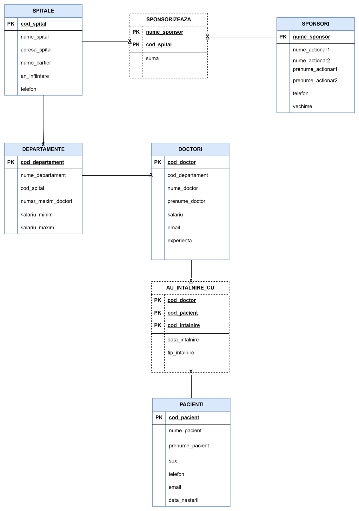

# 🏥 Proiect Baze de Date - Spitale și Sponsorizări

Acest proiect reprezintă un model de bază de date pentru gestionarea informațiilor legate de spitale, sponsori, doctori, pacienți și departamente, incluzând relațiile dintre aceștia.

---

## 🧩 Structura Bazei de Date

Modelul este ilustrat în diagrama ER de mai jos:

---

## 🗂️ Tabelele principale

- **SPITALE**: Informații despre spitale.
- **SPONSORI**: Organizații sau persoane care sponsorizează spitalele.
- **DEPARTAMENTE**: Departamente interne ale spitalelor.
- **DOCTORI**: Medicii care activează în cadrul departamentelor.
- **PACIENȚI**: Persoane tratate în spitale.

---

## 🔗 Relații

- `SPONSORIZEAZĂ`: Relație între SPONSORI și SPITALE.(MANY-TO-MANY)
- `AU_INTALNIRE_CU`: Relație între DOCTORI și PACIENȚI (de tip întâlnire/consultație).(MANY-TO-MANY)
- Fiecare DEPARTAMENT aparține unui SPITAL.
- Fiecare DOCTOR aparține unui DEPARTAMENT.

---

## 📁 Fișiere incluse

- `script.sql` – Script SQL care creează tabelele și relațiile definite în diagramă.
- `DiagramaSpitale.png` – Diagrama ER a bazei de date.

---

## 💡 Observații

- Diagrama este de tip conceptual.
- Scriptul SQL poate fi folosit într-un SGBD precum MySQL, PostgreSQL sau Oracle, cu adaptările necesare.
